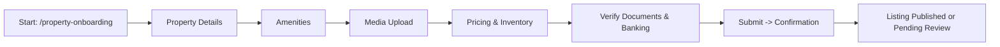

# Become a Vendor — TravelConnect

## Document summary

Purpose: Describe the user journey, UI screens, routes, components, data & validation, and error/edge-case handling for the "Become a Vendor" flow.

Audience: Product managers, engineers, QA, designers.

Scope: From click on “Become a Travel Vendor” to completion of category-specific vendor onboarding (e.g., flights, property).

---

## 1. Overview

Entry points:
- Header CTA (client/components/ServiceHeader.tsx)
  - signed-in users: navigate("/vendors")
  - not signed-in: navigate("/?auth=signin&next=/vendors")
- Landing page button (client/pages/Index.tsx) → `/vendors`
- Role selection during signup/onboarding (client/pages/Onboarding.tsx) → role === `travel-vendor` → `/vendors`

Main vendor landing: `/vendors` (client/pages/VendorCategories.tsx)

Category-specific onboarding routes: `/flights-onboarding`, `/property-onboarding`, `/experiences-onboarding`, `/events-onboarding`, etc.

Post-sign-up redirect: `/onboarding` (for travelers) or `/vendors` (for vendors) depending on role and next param.

---

## 2. Goals & success criteria

- Minimal friction selection of vendor type.
- Clear mapping from category to onboarding flow.
- Proper redirects for authenticated vs unauthenticated users.
- Save progress between steps and allow returning to incomplete onboarding.
- Validation and verification steps for sensitive data (business license, bank info).

---

## 3. Components involved (key files)

- client/components/ServiceHeader.tsx — CTA logic for vendor flow.
- client/pages/Index.tsx — Landing CTA linking to /vendors.
- client/pages/Onboarding.tsx — Role selection and routing (handles traveler, travel-vendor, travel-agent, admin).
- client/pages/VendorCategories.tsx — Lists vendor categories and links to category onboarding routes.
- client/pages/PropertyOwnerOnboarding.tsx — Example category onboarding flow (multi-step).
- client/components/AuthModal.tsx — Authentication modal; sign-up now redirects to /onboarding or next path.
- Shared UI: client/components/ui/card.tsx, ui/progress.tsx, ui/input.tsx, ui/label.tsx, ui/button.tsx, ui/toast.tsx — used across onboarding pages.

---

## 4. Full step-by-step user flow (detailed)

A. Entry & gating

1. User clicks “Become a Travel Vendor”:
   - If signedIn:
     - Action: `navigate("/vendors")`
     - Component: ServiceHeader.tsx (signedIn branch)
   - Else:
     - Action: `navigate("/?auth=signin&next=/vendors")`
     - Modal: AuthModal opens; after sign-up success -> `navigate(nextPath || "/onboarding")`

2. If user came via sign-up and selected role "travel-vendor" during Onboarding.tsx:
   - `handleRoleSelect("travel-vendor")` => `navigate("/vendors")`

3. `/vendors` shows list of categories, each with "Start" or card linking to the specific route.

B. Category selection

1. VendorCategories.tsx: categories array with `{ id, title, description, icon, to }` where `to` maps to:
   - `airlines` -> `/flights-onboarding`
   - `stays` -> `/property-onboarding`
   - `experiences` -> `/experiences-onboarding`
   - `events` -> `/events-onboarding`
   - `transfers` -> `/transfers-onboarding`
   - etc.

2. Click category -> navigate to the specified route. If the user is not signed in, route guards should redirect to sign-in with `next` param.

C. Category-specific onboarding (example: PropertyOwnerOnboarding.tsx)

1. Multi-step flow (typical steps):
   - Role (pre-filled from profile)
   - Property Details (name, location, type, rooms, star rating)
   - Amenities (checkboxes)
   - Media (images, videos)
   - Pricing & Inventory (rates, min stay, seasons)
   - Verify (documents, identity, banking)
   - Done (confirmation, listing goes live or under review)

2. UI behaviors:
   - Progress bar (client/components/ui/progress.tsx), step titles, next/back controls.
   - Data saved locally (component state) and persisted to backend after each step or when user clicks Continue.
   - Validation on required fields (e.g., property name, address), file size/type checks for media.
   - Verify step includes upload of verification documents and optionally background checks or business docs.

D. Post-onboarding

1. On success:
   - Display confirmation and recommended next steps.
   - Option to manage listing (link to vendor dashboard).
   - If admin approval required, show status "Pending review".

2. Notifications:
   - Toast messages (client/components/ui/toast.tsx) for success, errors.
   - Email notifications about verification status (backend responsibility).

---

## 5. Routing & navigation matrix

- GET `/vendors` -> VendorCategories
- GET `/flights-onboarding` -> FlightsOnboarding
- GET `/property-onboarding` -> PropertyOwnerOnboarding
- GET `/experiences-onboarding` -> ExperiencesOnboarding
- GET `/events-onboarding` -> EventsOnboarding
- Authentication redirect pattern: `/?auth=signin&next=/vendors` or `next=route`

---

## 6. Data model suggestions (simplified)

- User:
  - id, email, role (traveler, travel-vendor, travel-agent, admin), profile
- VendorProfile:
  - userId, vendorType, displayName, businessName, verified (boolean)
  - onboardingProgress: { step: string, data: object, lastUpdated: timestamp }
- Listing (category-specific fields vary):
  - id, vendorId, title, description, location, media[], amenities[], pricing, inventory, verificationStatus
- Documents:
  - docId, vendorId, type (id, business_license), status, uploadedAt

---

## 7. Validation & edge cases

- If an unauthenticated user tries to access a route that requires auth, redirect to sign-in with `next` param.
- If network errors during save, show toast and retry; preserve local state to avoid data loss.
- Partial saves should allow resuming onboarding: persist `onboardingProgress` on backend after each step or periodically (auto-save).
- Duplicate listings prevention: verify unique business identifier or owner email for same vendor.
- File uploads: limit size, enforce types, scan for malware off-platform.
- Rate-limiting: throttle repeated file uploads or verification requests.

---

## 8. Error handling & UX

- Inline validation: show errors next to fields.
- Global feedback: toast notifications for save failures, server errors, or success.
- Fallback UI: if the onboarding page fails to load, show a friendly error and CTA to retry or contact support.

---

## 9. Security & compliance notes

- Store sensitive docs in secure storage with restricted access (MCP: Neon/Supabase or cloud storage).
- Ensure personal and financial data encrypted at rest and in transit.
- Store minimal PII and follow regional regulations (GDPR, CCPA where applicable).
- Role-based access control for vendor admin routes.

---

## 10. Analytics & instrumentation

- Track events: `vendor_cta_clicked`, `vendor_category_selected`, `onboarding_step_completed`, `verification_uploaded`, `onboarding_completed`.
- Capture latencies and failure rates, and funnel drop-offs for optimization.

---

## 11. QA checklist

- Validate route guards and `next` param during sign-in.
- Ensure category->onboarding mapping is correct.
- Test multi-step save/resume functionality.
- Test file upload constraints and error handling.
- Test role selection during initial sign-up redirect behavior.

---

## 12. Diagrams (Mermaid source)

You can paste these into a Mermaid renderer or include them in documentation tools that support Mermaid. Images were omitted by request.

### A. High-level flow

```mermaid
flowchart TD
  A[User entry] -->|Click CTA| B{Signed in?}
  B -- Yes --> C[/vendors - Vendor Categories]
  B -- No --> D[Auth Modal ➜ Sign In/Sign Up]
  D -->|After sign-up| E{Role selected?}
  E -- travel-vendor --> C
  E -- traveler --> F[/onboarding (traveler)]
  C --> G{Select category}
  G -->|Flights| H[/flights-onboarding]
  G -->|Stays| I[/property-onboarding]
  G -->|Experiences| J[/experiences-onboarding]
  H --> K[Category onboarding steps -> Verify -> Done]
  I --> K
  J --> K
```

### B. Category onboarding (Property example)



### C. Authentication redirect pattern

```mermaid
flowchart TD
  U[Unauthenticated user clicks CTA] --> R[/?auth=signin&next=/vendors]
  R --> AuthModal
  AuthModal -->|Successful signup| Redirect[next || "/onboarding" or "/vendors"]
```

---

## 13. Suggested MCP integrations

You can connect the following MCPs from the Open MCP popover to support features:

- Builder.io — CMS, content & page management. Use for marketing pages and CMS-driven onboarding content. [Connect to Builder.io](#open-mcp-popover)
- Neon — serverless Postgres for vendor data and onboarding persistence. Useful for structured data. [Connect to Neon](#open-mcp-popover)
- Netlify — hosting and CI/CD for the app. [Connect to Netlify](#open-mcp-popover)
- Zapier — automations for notifications, Slack/email workflows when onboarding completes. [Connect to Zapier](#open-mcp-popover)
- Figma — convert or sync onboarding design to code using Builder.io Figma plugin if you have Figma designs. Use "Get Plugin" in MCP or the plugin URL.
- Supabase — optional alternative for database and auth (real-time updates). [Connect to Supabase](#open-mcp-popover)
- Linear — track onboarding tasks, bugs, and QA items. [Connect to Linear](#open-mcp-popover)
- Notion — store documentation or onboarding SOPs. [Connect to Notion](#open-mcp-popover)
- Sentry — error monitoring and release tracking for onboarding flows. [Connect to Sentry](#open-mcp-popover)
- Context7 — up-to-date docs reference for libraries/frameworks used. [Connect to Context7](#open-mcp-popover)
- Semgrep — static analysis for security vulnerabilities in onboarding code paths. [Connect to Semgrep](#open-mcp-popover)
- Prisma Postgres — if using Prisma for database models, connect for schema management. [Connect to Prisma Postgres](#open-mcp-popover)

---

## 14. Deliverables included in this repository

- docs/Become_a_Vendor.md — this file (full content).

---

## 15. Converting this Markdown to .docx (local)

If you want a .docx, run locally:

1. Install pandoc and (optionally) mermaid-cli if you want to render diagrams as images.
2. Save this file as `Become_a_Vendor.md` (already saved as `docs/Become_a_Vendor.md`).
3. Convert:

```bash
pandoc docs/Become_a_Vendor.md -o Become_a_Vendor.docx
```

To include diagrams as images, render them first with `mmdc` (Mermaid CLI), then reference images in the markdown before running pandoc.

---

## 16. Next steps I can take

- I can generate a ZIP containing this markdown and any rendered diagrams if you want.
- I can attempt to create a .docx here and add it to the repo — but generating a reliable binary .docx within this environment is not guaranteed; the safer approach is the pandoc method above.

Tell me which of the above you prefer and I will proceed.
